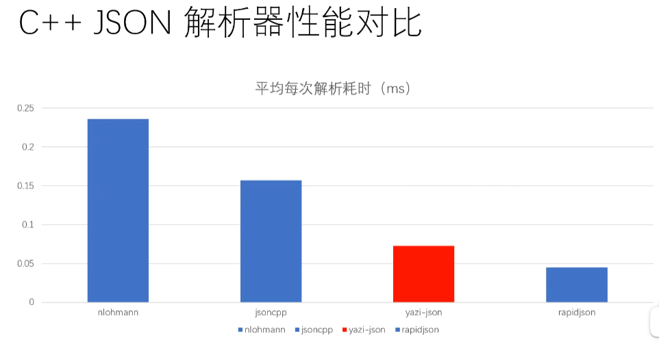

[yazi file](https://hkrb7870j3.feishu.cn/docx/doxcn4Qjv9EXC24N8817CyEQwwh)
[ini file](https://hkrb7870j3.feishu.cn/docx/doxcnOZZ8D98tFqvhVjkotaxSgd)
[C++ JSON 解析器设计与实现](https://hkrb7870j3.feishu.cn/docx/doxcnydT1EFccxOQzD7TwVyFZYg)
[C++ 日志系统](https://hkrb7870j3.feishu.cn/docx/doxcneWdfcpeluG6JyuerarCzsg)
[C++ 单例模式](https://hkrb7870j3.feishu.cn/docx/doxcnLkN4DIVd5sEz35QRnBdMeh?chunked=false)

常见的json解析器
- nlohmann
- jsoncpp
- rapidjson
- [yazi-json](https://github.com/Jiwangreal/yazi-json)

上述的json解析器性能对比